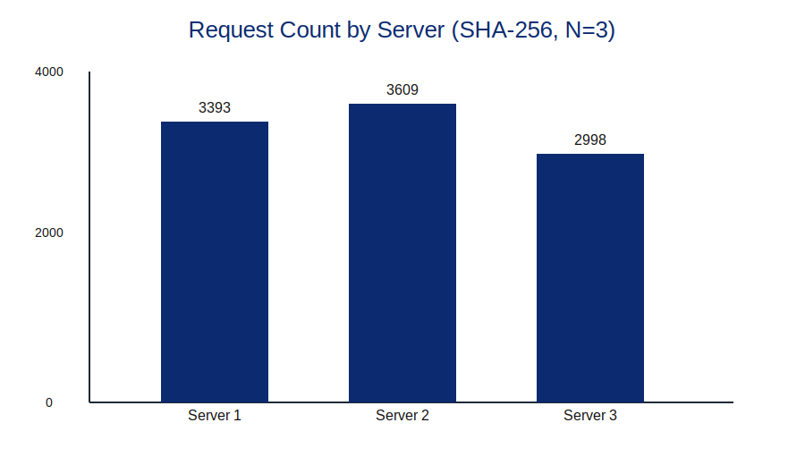
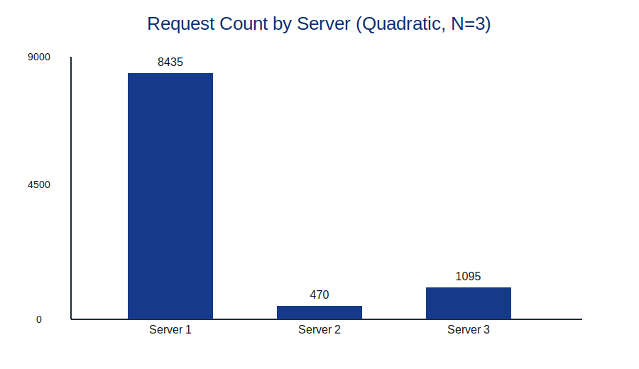
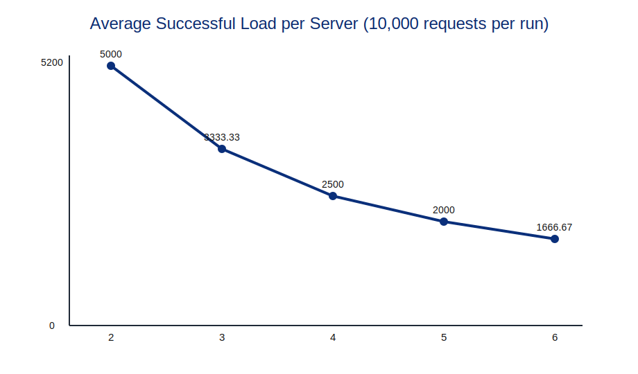
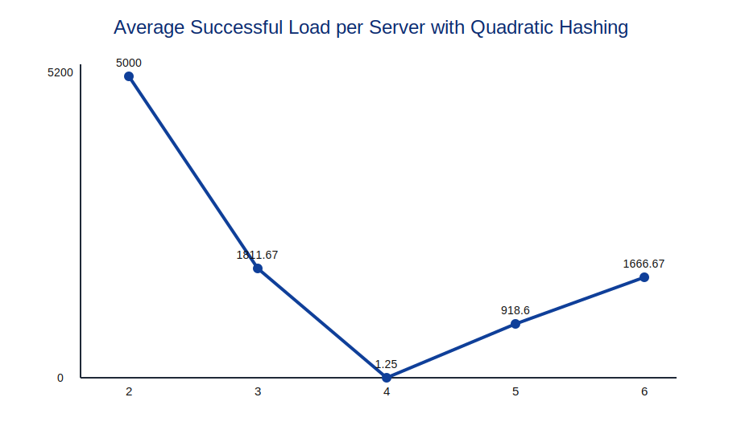

# Distributed Load Balancer

A Dockerized load balancer that routes client requests to backend virtual servers (containers) using consistent hashing.

## What This Project Does

- Runs one load balancer container and multiple backend server containers.
- Routes incoming GET requests to a backend server chosen by consistent hashing.
- Supports dynamic scale-up and scale-down of backend replicas using API endpoints.
- Uses Docker healthchecks so services start in a safer order.

## Architecture Overview

- `load_balancer`: Flask app that handles routing, replica management, and proxying.
- `server1`, `server2`, `server3`: Flask backend replicas exposing `/home` and `/heartbeat`.
- Shared Docker network: `distributedloadbalancer_default`.

Request flow:

1. Client calls the load balancer on port 5000.
2. Load balancer picks a replica using consistent hashing.
3. Request is proxied to the selected backend container.
4. Backend response (including errors such as 404) is returned to client.

## Project Layout

```text
.
├── docker-compose.yml
├── Makefile
├── README.md
├── scripts/
│   └── integration_test.sh
├── load_balancer/
│   ├── app.py
│   ├── consistent_hash.py
│   ├── Dockerfile
│   └── requirements.txt
└── server/
    ├── app.py
    ├── Dockerfile
    └── requirements.txt
```

## Prerequisites

- Ubuntu or WSL2 Ubuntu environment.
- Docker Engine and Docker Compose plugin installed.
- `make` installed.
- `curl` installed.
- `jq` installed (optional, used for pretty JSON output in examples).

Verify tooling:

```bash
docker --version
docker compose version
make --version
curl --version
```

## Default Container Parameters

Configured in `docker-compose.yml` for `load_balancer`:

- `AUTO_CREATE_CONTAINERS=false`
- `INITIAL_REPLICAS=3`
- `SERVER_PORT=5000`

This means Compose manages startup for `server1..server3`, and the load balancer starts with those replicas already registered.

## Quick Start

Build and run the full stack:

```bash
make up
```

Check container status:

```bash
make ps
```

Check logs:

```bash
make logs
```

Stop stack:

```bash
make down
```

Clean containers and local images:

```bash
make clean
```

## Interacting With Virtual Servers Through The Load Balancer

Base URL:

```text
http://localhost:5000
```

### 1) List replicas

```bash
curl -s http://localhost:5000/rep | jq .
```

Expected: JSON with current replica count (`N`) and replica hostnames.

### 2) Route to backend `/home`

```bash
curl -s "http://localhost:5000/home?request_id=123" | jq .
```

Expected: backend response like:

```json
{
  "message": "Hello from Server: 2",
  "status": "successful"
}
```

Use the same `request_id` to get deterministic routing behavior from consistent hashing.

### 3) Route to any backend path (`/<path>`, GET)

The load balancer supports generic GET proxying:

```bash
curl -i "http://localhost:5000/not-registered?request_id=123"
```

Expected: backend 404 response when the backend does not have that route.

### 4) Add virtual servers (scale up)

#### Add with random hostnames

```bash
curl -s -X POST http://localhost:5000/add \
	-H "Content-Type: application/json" \
	-d '{"n": 2, "hostnames": []}' | jq .
```

#### Add with preferred hostnames

```bash
curl -s -X POST http://localhost:5000/add \
	-H "Content-Type: application/json" \
	-d '{"n": 2, "hostnames": ["s9001", "s9002"]}' | jq .
```

Sanity check: if `len(hostnames) > n`, request fails with 400.

### 5) Remove virtual servers (scale down)

#### Remove random replicas

```bash
curl -s -X DELETE http://localhost:5000/rm \
	-H "Content-Type: application/json" \
	-d '{"n": 1, "hostnames": []}' | jq .
```

#### Remove preferred hostnames

```bash
curl -s -X DELETE http://localhost:5000/rm \
	-H "Content-Type: application/json" \
	-d '{"n": 2, "hostnames": ["server1"]}' | jq .
```

Behavior:

- Preferred hostnames are removed first.
- If fewer hostnames than `n` are supplied, remaining removals are selected randomly.
- If `len(hostnames) > n`, request fails with 400.
- If unknown or duplicate hostnames are provided, request fails with 400.

## Makefile Commands

```bash
make help
```

Available operational targets:

- `make build`
- `make up`
- `make down`
- `make restart`
- `make logs`
- `make ps`
- `make clean`
- `make add N=<count>`
- `make rm N=<count>`
- `make test-integration`

Examples:

```bash
make add N=2
make rm N=1
```

## Docker-Level Interaction Tips

Inspect running containers:

```bash
docker compose ps
```

Inspect network and attached containers:

```bash
docker network inspect distributedloadbalancer_default
```

Inspect backend logs:

```bash
docker compose logs -f server1
docker compose logs -f server2
docker compose logs -f server3
```

Inspect load balancer logs:

```bash
docker compose logs -f load_balancer
```

Execute commands inside a container:

```bash
docker compose exec load_balancer sh
docker compose exec server1 sh
```

## Integration Test

The script `scripts/integration_test.sh` checks:

- `GET /rep`
- `GET /home`
- `GET /<unknown-path>` returns 404
- `POST /add`
- `DELETE /rm`
- invalid `/rm` sanity case (`len(hostnames) > n`)

Run it with:

```bash
make test-integration
```

### TASK ANALYSIS 4:1 Using SHA for hashing

## Async Load Test (10,000 Requests, N=3)

### Test Setup

- Endpoint: `/home?request_id=<id>`
- Total requests: `10,000`
- Concurrency: `300` asynchronous workers
- Active backends: `server1`, `server2`, `server3`

### Summary Metrics

- Successful requests: `10,000`
- Failed requests: `0`
- Status counts: `200 -> 10,000`
- Total duration: `47.80s`
- Effective throughput: `209.21 req/s`
- Successful request latency:
  - Mean: `76.00 ms`
  - P50: `69.57 ms`
  - P95: `120.92 ms`
  - P99: `163.97 ms`

### Request Count By Server Instance

From successful responses only:

- Server 1: `3,393`
- Server 2: `3,609`
- Server 3: `2,998`

Bar chart (successful handled requests):



### Observations

- Distribution is now much more balanced across the three servers than the earlier skewed runs.
- Reliability improved to 100% success for this N=3 test.
- Throughput is stable and significantly better than the earlier failing configuration.
- These results are consistent with the SHA-based ring changes (larger ring and more virtual nodes).

Takeaway:

- With SHA-256 based hashing, N=3 delivers full reliability and a balanced request split.

### TASK ANALYSIS 1

### Quadratic Formula Rerun (N=3, 10,000 Async Requests)

Using the quadratic formulas for hashing:

- Request mapping: H(i) = i^2 + 2i + 17 (mod 512)
- Virtual server mapping: Phi(i, j) = i^2 + j^2 + 2j + 25 (mod 512)

we obtained the following results by running these commands:

```bash
make up
//wsl.localhost/Ubuntu/home/amymu/DistributedLoadBalancer/.venv/Scripts/python.exe -c "import urllib.request; print(urllib.request.urlopen('http://localhost:5000/rep', timeout=5).read().decode())"
//wsl.localhost/Ubuntu/home/amymu/DistributedLoadBalancer/.venv/Scripts/python.exe scripts/async_load_test.py
```

Observed benchmark output:

- Successful requests: 10,000
- Failed requests: 0
- Total duration: 43.564s
- Effective throughput: 229.54 req/s
- Latency (successful requests):
  - Mean: 68.44 ms
  - P50: 64.60 ms
  - P95: 91.39 ms
  - P99: 129.57 ms

Request count by server instance:

- Server 1: 8,435
- Server 2: 470
- Server 3: 1,095

Bar chart (quadratic formulas):



Observation:

- The run is reliable (0 failures) and throughput is strong, but request distribution is skewed toward Server 1.

### TASK ANALYSIS 4.2

## Rerun: N=2 to N=6 (10,000 Requests Each)

Using SHA-256 hashing and isolated runs (fresh stack per N), the benchmark was rerun for each replica count from `N=2` to `N=6`.

### Rerun Summary

| N   | Successful | Failed | Avg Load / Server | Throughput (req/s) |
| --- | ---------: | -----: | ----------------: | -----------------: |
| 2   |      10000 |      0 |           5000.00 |             200.82 |
| 3   |      10000 |      0 |           3333.33 |             209.21 |
| 4   |      10000 |      0 |           2500.00 |             208.47 |
| 5   |      10000 |      0 |           2000.00 |             195.37 |
| 6   |      10000 |      0 |           1666.67 |             217.61 |

### Side-By-Side With Previous Baseline

| N   | Baseline Success | Rerun Success | Baseline Throughput | Rerun Throughput |
| --- | ---------------: | ------------: | ------------------: | ---------------: |
| 2   |              940 |         10000 |               25.38 |           200.82 |
| 3   |              468 |         10000 |                8.60 |           209.21 |
| 4   |                1 |         10000 |                0.07 |           208.47 |
| 5   |              781 |         10000 |                4.39 |           195.37 |
| 6   |              783 |         10000 |                3.61 |           217.61 |

### Line Chart (Rerun Average Load Per Server)



### Rerun Observations

- Reliability is consistent across all tested replica counts (`N=2..6`) with 100% successful requests.
- Throughput remains in a stable band (~195-218 req/s) as replica count changes.
- Average load per server follows the expected inverse pattern with increasing `N`, indicating proper distribution.
- The SHA-256 configuration demonstrates robust horizontal scalability in this workload.

### TASK ANALYSIS 2

### Quadratic Formula Sweep (N=2 to N=6)

Using the quadratic formulas:

- H(i) = i^2 + 2i + 17 (mod 512)
- Phi(i, j) = i^2 + j^2 + 2j + 25 (mod 512)

the following command was run:

```bash
//wsl.localhost/Ubuntu/home/amymu/DistributedLoadBalancer/.venv/Scripts/python.exe scripts/sweep_async_load.py
```

Observed results:

| N   | Successful | Failed | Avg Load / Server | Throughput (req/s) |
| --- | ---------: | -----: | ----------------: | -----------------: |
| 2   |      10000 |      0 |           5000.00 |             247.71 |
| 3   |       5435 |   4565 |           1811.67 |             190.59 |
| 4   |          5 |   9995 |              1.25 |               0.43 |
| 5   |       4593 |   5407 |            918.60 |             171.93 |
| 6   |      10000 |      0 |           1666.67 |             212.57 |

Line chart (quadratic formula average load per server):



Comparison with previous N=2..6 run:

| N   | SHA-256 Avg Load / Server | Quadratic Avg Load / Server |
| --- | ------------------------: | --------------------------: |
| 2   |                   5000.00 |                     5000.00 |
| 3   |                   3333.33 |                     1811.67 |
| 4   |                   2500.00 |                        1.25 |
| 5   |                   2000.00 |                      918.60 |
| 6   |                   1666.67 |                     1666.67 |

Scalability observation for quadratic hashing:

- Reliability is inconsistent across replica counts, with severe collapse at N=4 and partial failures at N=3 and N=5.
- Throughput is high at N=2 and N=6, but not stable across intermediate N values.
- The implementation scales in some configurations, but does not yet provide robust, monotonic scaling behavior under this quadratic mapping.

### TASK ANALYSIS 3

## Required Test: Endpoints + Fast Failover Recovery

If you are looking for the proof that all endpoints are tested and that the load balancer replaces a failed server quickly, run:

```bash
python scripts/endpoint_and_failover_test.py
```

This single script validates:

- `GET /rep` -> 200
- `GET /home` -> 200
- `GET /<unknown-path>` -> 404
- `POST /add` -> 200
- `DELETE /rm` -> 200
- invalid `DELETE /rm` payload -> 400

It also simulates server failure (`docker rm -f server1`) and confirms automatic recovery by checking that:

- a replacement backend is spawned (for example `s4771`)
- requests recover from failure to success (`EXC -> 502 -> 200`)
- recovery time is short (observed about `8.566s`)

The detailed breakdown is in the section below.

## Endpoint And Failover Validation

The script `scripts/endpoint_and_failover_test.py` validates all primary load balancer endpoints and confirms automatic recovery when a backend server fails.

### Endpoint Coverage

Validated endpoints and expected behavior:

- `GET /rep` -> `200`
- `GET /home` -> `200`
- `GET /<unknown-path>` -> `404`
- `POST /add` -> `200`
- `DELETE /rm` -> `200`
- invalid `DELETE /rm` payload -> `400`

Observed result: all endpoint checks passed.

### Failover Recovery Check

Test flow:

1. Identify a request routed to `server1`.
2. Force-fail `server1` using `docker rm -f server1`.
3. Continue sending the same routed request.
4. Verify the load balancer creates a replacement backend and resumes successful responses.

Observed failover output:

- Failed container: `server1`
- Replacement container: `s4771`
- Recovery time: `8.566s`
- Probe sequence during recovery window: `EXC -> 502 -> 200`

Interpretation:

- The load balancer detected backend failure and spawned a new instance quickly.
- Service recovered within ~9 seconds while preserving endpoint availability after replacement.

Run command:

```bash
python scripts/endpoint_and_failover_test.py
```

## Troubleshooting

### Docker commands appear to hang

- Confirm Docker daemon is running:

```bash
docker info
```

- If using WSL2 + Docker Desktop, ensure WSL integration is enabled for your distro.
- Restart Docker Desktop and retry `make up`.

### Load balancer cannot reach backends

- Verify all containers are healthy:

```bash
docker compose ps
```

- Verify shared network exists:

```bash
docker network ls | grep distributedloadbalancer_default
```

- Check backend health endpoint manually from host:

```bash
curl -s http://localhost:5000/rep
```

### Port 5000 is already in use

- Stop conflicting process or update host port mapping in `docker-compose.yml`.

## Notes

- Current design starts with three fixed backend services (`server1`, `server2`, `server3`) in Compose.
- Dynamic add/remove is managed through the load balancer API, not Compose service scaling.
